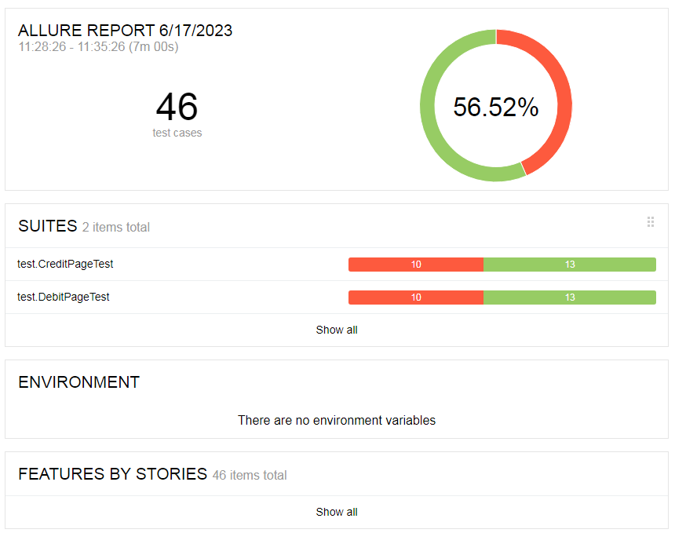
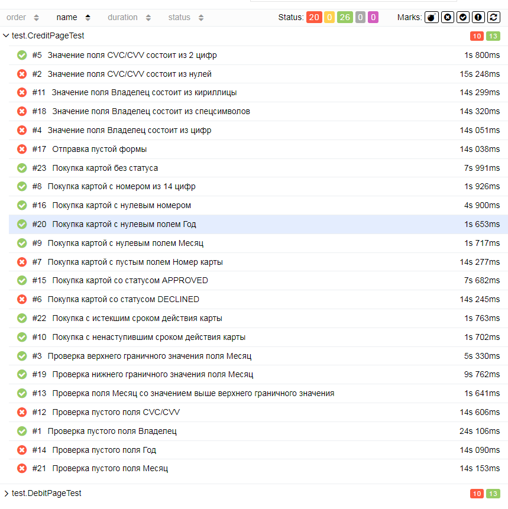
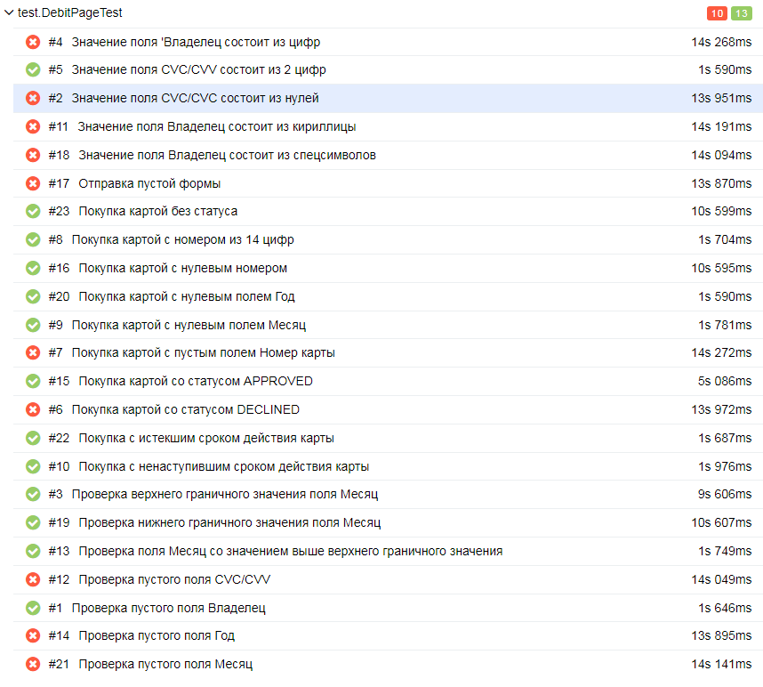

# Отчет по итогам тестирования приложения "Путешествие дня" #
### Краткое описание
В соответствии с планом автоматизации было проведено автоматизированное тестирование приложения "Путешествие дня".
### Количество тест-кейсов
Общее количество тест-кейсов - 46:
* Покупка дебетовой картой - 23, из них:
    - позитивные - 13;
    - негативные - 10;
* Покупка в кредит - 23, из них:
    - позитивные - 13;
    - негативные - 10.

### Успешных тестов-кейсов: 
56,52% 
### Не успешных тест-кейсов:
43.48%

### Общие рекомендации
Описать настройку окружения, составить техническую документацию.